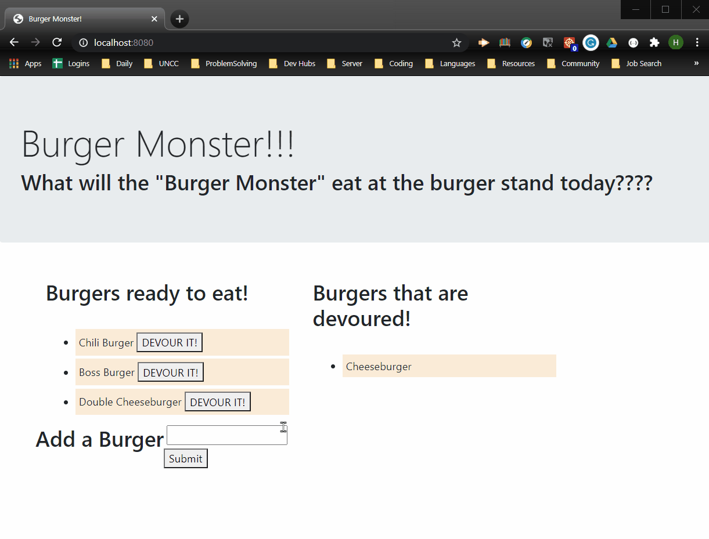
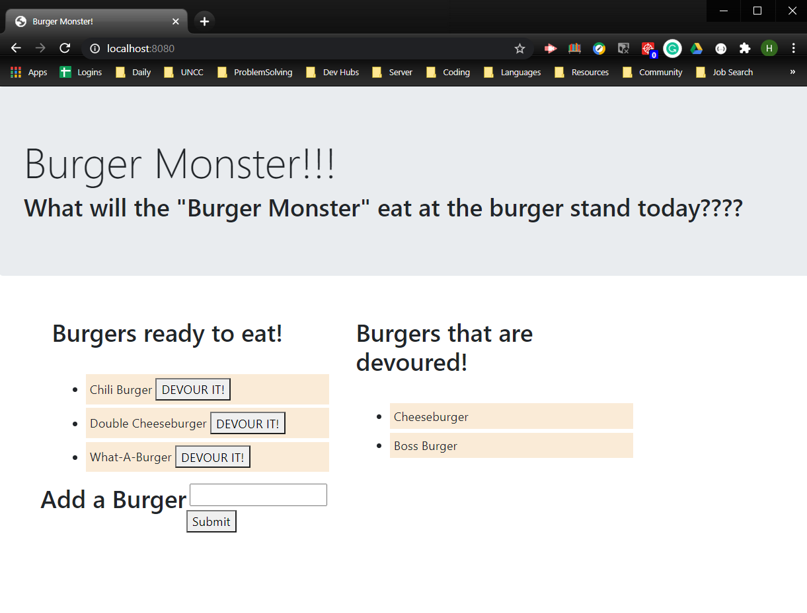

# Burger Monster App


## Description
This application allows the user to add "burgers" using the text area box to the "ready-to-eat" column by clicking the submit button and then move the burger to the "devoured" column by clicking the "devour" button.

This application demonstrates how an ORM can be used to interface with a SQL database in a modular fashion. Following the MVC (Model View Controller) architecture, the full-stack application is broken into modular coding blocks organized into the file structure based on the code block's usage.

## Deployment

[Burger Monster](https://)



## Table of Contents

* [Installation](#installation)
* [Technology Used](#technology-used)
* [Usage](#usage)
* [Screenshots](#screenshots)
* [Questions](#questions)
* [Authors](#author)
* [Contributing](#contributing)


## Installation
To install the needed npm packages, please run the following command in terminal:
  
```
npm i
```
To install the database, please follow the following instructions:

1. Within the terminal, navigate to the "db" folder containing the schema.sql file.
2. Start the MySQL command line tool and login:
```
mysql -u root -p
```
3. With the "mysql>" command line tool running, enter the following command:
```
source schema.sql
```
4. **OPTIONAL** If you would like to have starting data, you may also populate the database using the seeds.sql file by running the following command:
```
source seeds.sql
```
5. Close the MySQL command line tool by running the following command:
```
exit
```

## Technology Used

Languages
- HTML
- CSS
- Javascript
- SQL

Libraries
- jQuery
- Express
- MySQL
- Handlebars

## Usage
This application allows the user to add "burgers" using the text area box to the "ready-to-eat" column by clicking the submit button and then move the burger to the "devoured" column by clicking the "devour" button.

## Screenshots



*Home Page of Burger Monster*

## Questions
If you have any questions about the repo, open an issue or contact [Hlsorrells](github.com/Hlsorrells) directly at [hlsorrells.dev@gmail.com](mailto:hlsorrells.dev@gmail.com).

## Author

[Heather Sorrells](mailto:hlsorrells.dev@gmail.com)

## Contributing
Go to GitHub repo and create a pull request or email the developer directly. See [Questions](#questions).
